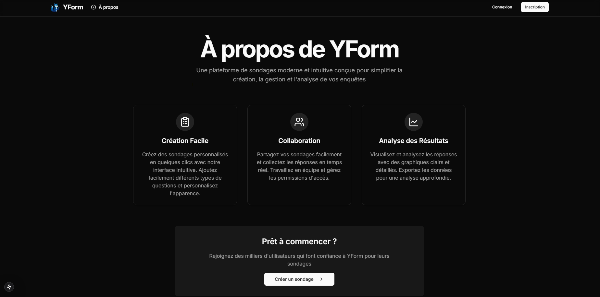
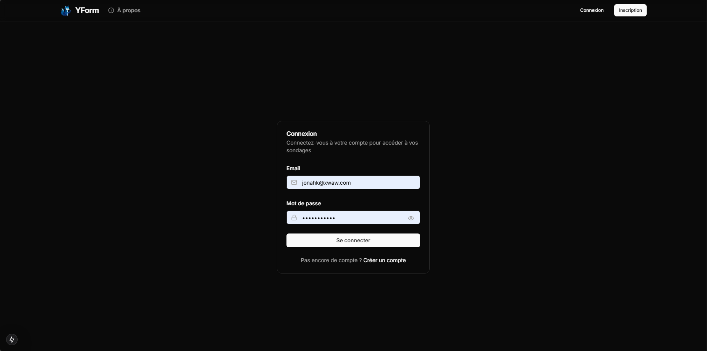
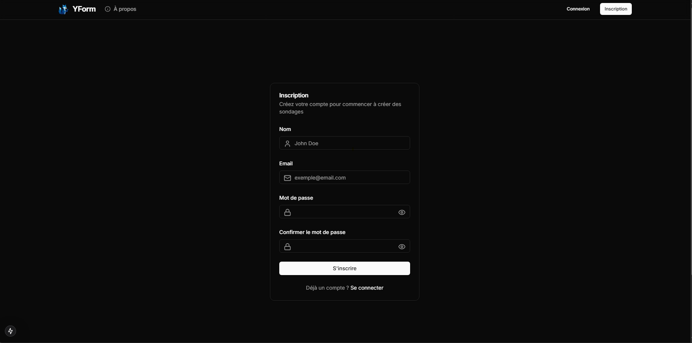
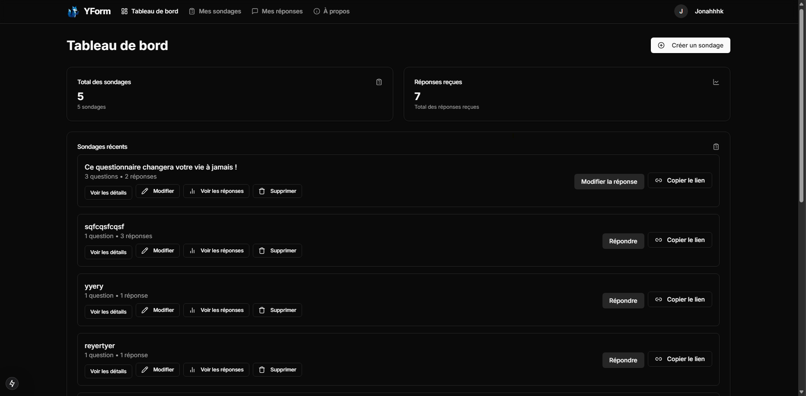
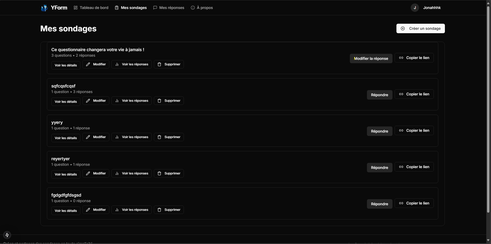
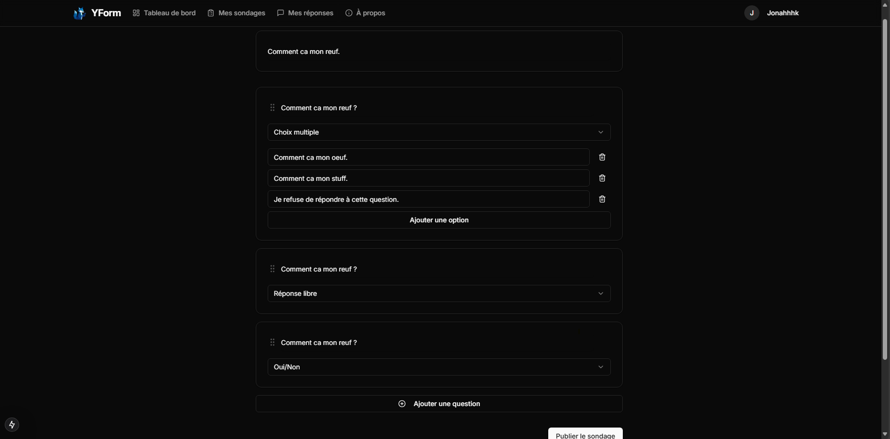
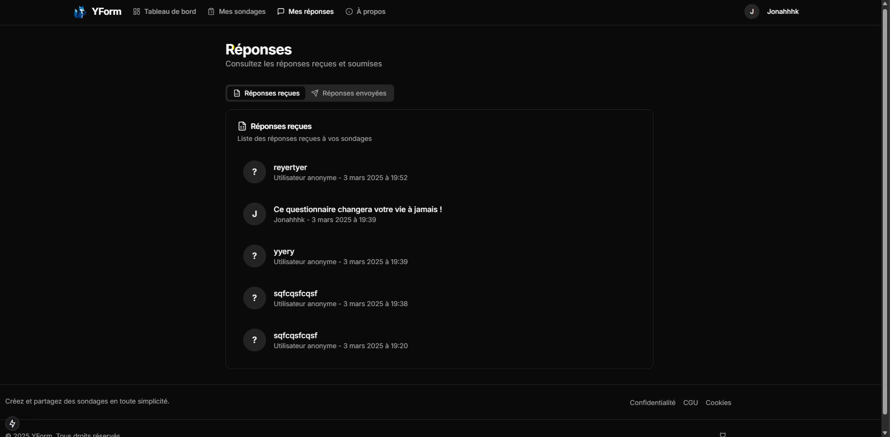
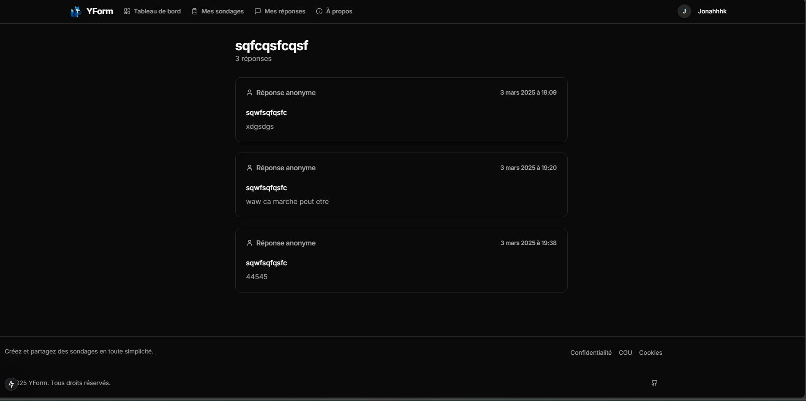

# YForm

Une application de gestion de sondages avec une architecture moderne et performante.

## 🚀 Technologies

### Frontend
- **Framework**: Next.js 15 avec React 19
- **Styling**: Tailwind CSS, Shadcn UI, Lucide React (icons)
- **State Management**: React Hook Form, Zustand
- **Form Validation**: Zod, Hookform Resolvers
- **UI/UX**: DND Kit (drag and drop), Radix UI (accessible components), Shadcn UI 
- **Authentication**: JWT avec custom hooks, JS-Cookie
- **Date Handling**: date-fns
- **Theming**: next-themes
- **Testing**: Jest, React Testing Library

### Backend
- **Runtime**: Node.js (ESM modules)
- **Framework**: Express
- **Database**: MongoDB avec Mongoose (schémas, relations, middleware)
- **Authentication**: JWT (jsonwebtoken), standard et optionnelle
- **Password Hashing**: bcrypt
- **Security**: CORS configurable, headers de sécurité HTTP
- **Architecture**: MVC+S (Modèle-Vue-Contrôleur + Services)
- **Error Handling**: Middleware centralisé, gestion des erreurs API
- **Environment**: dotenv, configuration multi-environnement
- **Testing**: Jest, Supertest pour tests d'intégration API
- **Development**: Nodemon, Cross-env

## ✨ Fonctionnalités

### Gestion des Sondages
- **Création avancée**: Questions ouvertes, choix multiples, Oui/Non
- **Gestion complète**: Création, modification, suppression, duplication de questions et sondages
- **Organisation intuitive**: Interface drag & drop pour réorganiser les questions
- **Partage facile**: Copie de liens de sondage avec un clic

### Participation aux Sondages
- **Réponses flexibles**: Possibilité de répondre avec ou sans compte (mode anonyme)
- **Interface conviviale**: Formulaires clairs et adaptés à chaque type de question
- **Accessibilité**: Compatible mobile et desktop

### Analyse et Visualisation
- **Tableau de bord**: Vue d'ensemble des activités et statistiques
- **Compteurs de réponses**: Nombre de réponses par sondage
- **Liste des réponses**: Visualisation détaillée des réponses reçues
- **Filtrage**: Organisation des réponses par date, sondage, etc.

### Gestion de Compte
- **Authentification sécurisée**: JWT avec expire et refresh tokens
- **Profil utilisateur**: Modification des informations personnelles
- **Sécurité**: Mise à jour du mot de passe avec vérification
- **Préférences**: Personnalisation du thème (clair/sombre/système)

### UX/UI
- **Design responsive**: Adaptation à tous les appareils et tailles d'écran
- **Mode sombre/clair**: Thème personnalisable selon les préférences
- **Notifications**: Feedback utilisateur via toasts pour toutes les actions
- **Navigation intuitive**: Structure claire et cohérente

## 🔧 Installation

### Prérequis
- Node.js (v18+)
- MongoDB (v5+)
- Git

### Étapes d'installation

1. **Cloner le dépôt**
```bash
git clone <repository-url>
cd YForm
```

2. **Installer et configurer le backend**
```bash
cd Back
npm install
cp .env.example .env
```

Puis, ouvrez le fichier `.env` et configurez les variables suivantes:
- `DB_USER` et `DB_PASSWORD`: Vos identifiants MongoDB Atlas (ou laissez vide pour MongoDB local)
- `JWT_SECRET`: Une chaîne aléatoire sécurisée pour signer les tokens JWT
- `FRONTEND_URL`: URL du frontend (pour les CORS)

3. **Installer et configurer le frontend**
```bash
cd ../front
npm install
cp .env.example .env
```

Puis, configurez le fichier `.env`:
- `NEXT_PUBLIC_API_URL`: URL de l'API backend (par défaut: http://localhost:5000)

## 🚀 Démarrage

### Backend
```bash
cd Back
npm run dev  # Démarre le serveur avec Nodemon (redémarrage automatique)
# OU
npm start    # Démarre le serveur sans surveillance des modifications
```

### Frontend
```bash
cd front
npm run dev  # Démarre le serveur de développement Next.js avec TurboSuperpack
```

Accès:
- Frontend: [http://localhost:3000](http://localhost:3000)
- API Backend: [http://localhost:5000](http://localhost:5000)

## 🧠 Architecture du projet

### Frontend (Next.js)
```
front/
├── src/
│   ├── app/           # Routes et pages Next.js (App Router)
│   ├── components/    # Composants React réutilisables
│   │   ├── ui/        # Composants d'interface utilisateur (Shadcn)
│   │   ├── auth/      # Composants d'authentification
│   │   ├── surveys/   # Composants de gestion de sondages
│   │   └── layout/    # Composants de mise en page
│   ├── hooks/         # Custom React hooks
│   └── lib/           # Fonctions utilitaires et types
│       ├── api/       # Fonctions d'appel API
│       └── types/     # Définitions TypeScript
```

### Backend (Node.js)
```
Back/
├── controllers/       # Logique de traitement des requêtes
├── middleware/        # Middlewares Express (auth, error handling)
├── models/            # Schémas et modèles MongoDB (Mongoose)
├── routes/            # Définitions des routes API
├── services/          # Logique métier séparée des contrôleurs
├── config/            # Configuration (DB, etc.)
└── tests/             # Tests unitaires et d'intégration
```

## 📝 API Endpoints

### Authentification
- `POST /api/auth/register` - Inscription d'un nouvel utilisateur
- `POST /api/auth/login` - Connexion utilisateur
- `GET /api/auth/me` - Récupérer le profil utilisateur connecté
- `PUT /api/auth/me` - Mettre à jour le profil utilisateur
- `POST /api/auth/logout` - Déconnexion (côté client)

### Sondages
- `GET /api/surveys` - Liste de tous les sondages
- `GET /api/surveys/user` - Liste des sondages de l'utilisateur connecté
- `POST /api/surveys` - Créer un nouveau sondage
- `GET /api/surveys/:id` - Détails d'un sondage spécifique
- `PUT /api/surveys/:id` - Mettre à jour un sondage
- `DELETE /api/surveys/:id` - Supprimer un sondage
- `GET /api/surveys/:id/responses/count` - Nombre de réponses pour un sondage

### Réponses
- `POST /api/responses` - Soumettre une réponse (authentifiée ou anonyme)
- `GET /api/responses/total` - Nombre total de réponses pour tous les sondages de l'utilisateur
- `GET /api/responses/user` - Liste des réponses de l'utilisateur connecté
- `GET /api/responses/survey/:survey_id` - Réponses pour un sondage spécifique
- `GET /api/responses/:response_id` - Détails d'une réponse spécifique
- `DELETE /api/responses/:response_id` - Supprimer une réponse

## 🔐 Variables d'environnement

### Backend (.env)
```
# Server Configuration
PORT=5000                      # Port du serveur Express
NODE_ENV=development           # Environnement (development, production, test)

# MongoDB Configuration
DB_USER=your_mongodb_user      # Utilisateur MongoDB Atlas
DB_PASSWORD=your_mongodb_pass  # Mot de passe MongoDB Atlas
MONGODB_URI=mongodb+srv://...   # URI complète de connexion MongoDB
MONGODB_URI_TEST=mongodb+srv://... # URI pour les tests

# JWT Configuration
JWT_SECRET=your_secret_key     # Clé secrète pour signer les tokens JWT
JWT_EXPIRES_IN=24h             # Durée de validité des tokens

# Frontend URL (pour CORS)
FRONTEND_URL=http://localhost:3000  # URL du frontend pour configuration CORS
```

### Frontend (.env)
```
# API Configuration
NEXT_PUBLIC_API_URL=http://localhost:5000  # URL de l'API backend
NEXT_PUBLIC_APP_URL=http://localhost:3000  # URL de l'application frontend

# Authentication
NEXTAUTH_URL=http://localhost:3000         # URL pour NextAuth
NEXTAUTH_SECRET=your_secret_key            # Clé secrète pour NextAuth

# Analytics (optionnel)
# NEXT_PUBLIC_ANALYTICS_ID=your_analytics_id  # ID pour intégration analytics
```

## 🧪 Tests

Le projet inclut des tests unitaires et d'intégration pour garantir la fiabilité du code.

### Backend
```bash
cd Back
npm run test                  # Exécute tous les tests avec Jest
```

Les tests backend utilisent Jest et Supertest pour tester les endpoints API avec une base de données MongoDB de test dédiée.

### Frontend
```bash
cd front
npm run test                  # Exécute tous les tests
npm run test:watch            # Exécute les tests en mode watch (utile pendant le développement)
```

Les tests frontend utilisent Jest, React Testing Library et Testing Library User Event pour tester les composants, les hooks et les interactions utilisateur.

## 🤝 Contribution

1. Fork le projet
2. Créer une branche (`git checkout -b feature/amazing-feature`)
3. Commit les changements (`git commit -m 'Add some amazing feature'`)
4. Push vers la branche (`git push origin feature/amazing-feature`)
5. Ouvrir une Pull Request

## 📝 Note

Projet académique réalisé pour le cours de NoSQL à Ynov. Ce projet démontre l'utilisation de MongoDB dans une application web moderne avec une architecture scalable et maintenable.

## 📸 Captures d'écran

### Page d'accueil


### Page À propos


### Connexion


### Inscription


### Tableau de bord


### Liste des sondages


### Création de sondage


### Liste des réponses


### Détail d'une réponse


> **Note**: Ces captures d'écran ne présentent qu'un aperçu des principales fonctionnalités. L'application offre de nombreuses autres fonctionnalités et interactions à découvrir.

## 👥 Auteur
Ce projet a été développé dans le cadre du cours de NoSQL à Ynov par Lucas REMERY
